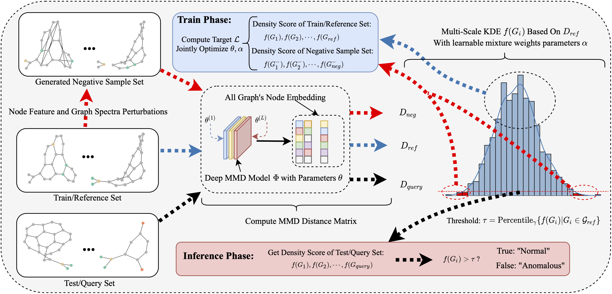

# [ICML 2026] Learnable Kernel Density Estimation for Graphs (LGKDE) and Its Application to Graph-Level Anomaly Detection

[](https://www.python.org/)
[](https://developer.nvidia.com/cuda-toolkit)
[](https://pytorch.org/)
[](https://www.dgl.ai/)

This repository provides the implementation of the ICML 2026 paper "*Learnable Kernel Density Estimation for Graphs and Its Application to Graph-Level Anomaly Detection*".

If you find this repository useful or use it in your research, please cite our paper:

```bibtex
@inproceedings{wang2026learnable,
  title={Learnable Kernel Density Estimation for Graphs and Its Application to Graph-Level Anomaly Detection},
  author={Wang, Xudong and Sun, Ziheng and Ding, Chris and Fan, Jicong},
  booktitle={Proceedings of the International Conference on Machine Learning},
  year={2026}
}
```

## Overview

LGKDE is a learnable kernel density estimation framework for graph-structured data. It represents each graph as a distribution over node embeddings, learns graph distances through a deep MMD metric, and estimates graph density with a multi-scale KDE. For graph-level anomaly detection, LGKDE learns by contrasting normal graphs with structure-aware perturbed counterparts generated from node features and graph spectra.

.

## Project Structure

```text
.
├── configs/
│   ├── MUTAG.yaml           # Example configuration
├── figs/                    
├── GraphEnv.yml             # Conda environment specification
├── main.py                  # Main training and evaluation entry point
├── experiment.py            # Trainer, evaluation loop, early stopping, logging
├── model.py                 # LGKDE model, GNN encoder, MMD distance, KDE scoring
├── dataprocessing.py        # DGL dataset loading and anomaly split construction
├── ng.py                    # Structure-aware negative graph generation
├── losses.py                # Density contrastive objectives
├── evaluation.py            # AUROC, AUPR, FPR95 and auxiliary metrics
├──utils.py                 # Seed and visualization utilities
├── Benchmarks/
└──  └── RUN-UBGOLD.sh        # Commands for running UB-GOLD benchmark baselines, Ref Please https://github.com/UB-GOLD/UB-GOLD
```

## Usage and Quick Start

```bash
python main.py --config configs/MUTAG.yaml
```

The datasets are loaded through DGL and will be downloaded automatically if they are not already available in the local DGL cache.

## Configuration

The main options are controlled by YAML files under [configs](./configs).

- `dataset.name`: Dataset name, such as `MUTAG` or `PROTEINS`.
- `dataset.type`: DGL dataset source, currently `GIN` or `TU`.
- `dataset.normal_class`: Class treated as normal. Use `null` to select the majority class automatically.
- `dataset.train_ratio`: Fraction of normal graphs used for training.
- `dataset.mixed_anomaly_ratio`: Fraction of anomalies mixed into the training set.
- `dataset.batch_size`: Training batch size. Use `null` for full-batch training.
- `model.in_dim`: Input node feature dimension. Use `null` to infer it automatically from the dataset.
- `model.hidden_dim`: Hidden dimension of the GNN encoder.
- `model.out_dim`: Output node embedding dimension.
- `model.num_layers`: Number of graph convolution layers.
- `model.bandwidths`: KDE bandwidth set for multi-scale density estimation.
- `model.learn_kde_weights`: Whether to learn the bandwidth mixture weights.
- `negative_sampling.perturbation_methods`: Perturbation types used for density contrastive learning.
- `training.epochs`: Number of training epochs.
- `training.lr`: Learning rate.
- `training.weight_decay`: Weight decay.
- `training.loss_type`: Density contrastive loss, either `LogRatioLossAD` or `AnomalyDetectionLoss`.
- `evaluation.anomaly_threshold_percentile`: Quantile threshold for anomaly prediction.

Experiment outputs are saved under `base.save_dir`, with model checkpoints in `SavedModels/` and records/figures in `ExperimentRecords/`.

## Benchmark Baselines

Commands for running the UB-GOLD graph-level anomaly detection benchmark baselines are provided in [Benchmarks/RUN-UBGOLD.sh](./Benchmarks/RUN-UBGOLD.sh). Please refer to the UB-GOLD repository (https://github.com/UB-GOLD/UB-GOLD) for instructions on setting up the benchmark environment and datasets.
## Requirements

### Hardware Requirements

- NVIDIA GPU with CUDA support
- Recommended GPU memory: 8GB or higher for small TU datasets; larger datasets may require more memory

### Software Requirements

- Python 3.10+
- CUDA 12.1+
- PyTorch 2.1.0+
- DGL 2.4.0+
- scikit-learn, scipy, numpy, matplotlib, tensorboard

## Environment Setup

Create the conda environment from the provided file:

```bash
conda env create -f GraphEnv.yml
conda activate Graph
```

Verify the CUDA setup:

```bash
nvidia-smi
python -c "import torch; print(torch.__version__, torch.cuda.is_available())"
```

## Contact

- Email: [xudongwang@link.cuhk.edu.cn](mailto:xudongwang@link.cuhk.edu.cn)
